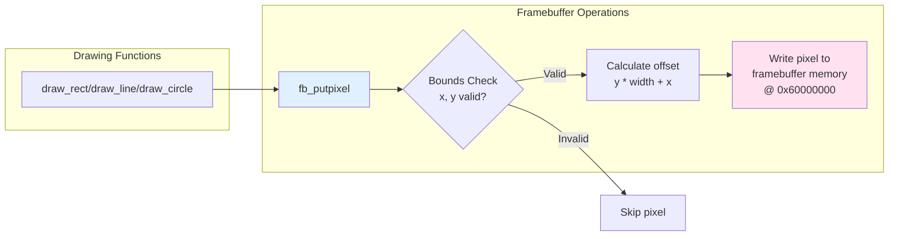
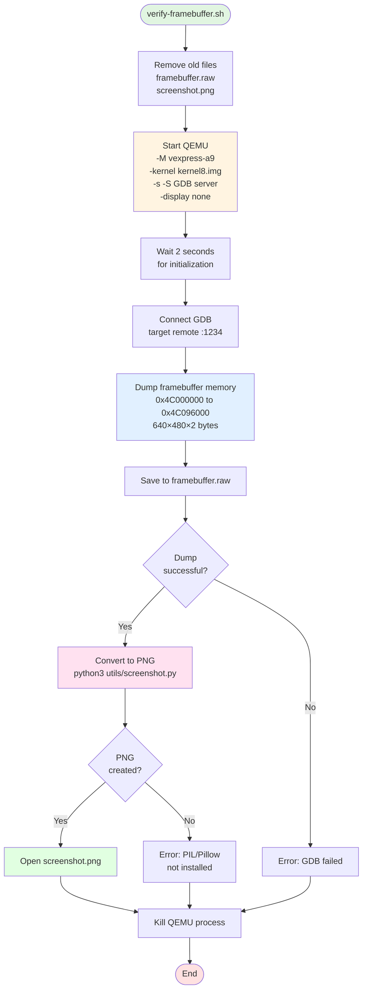
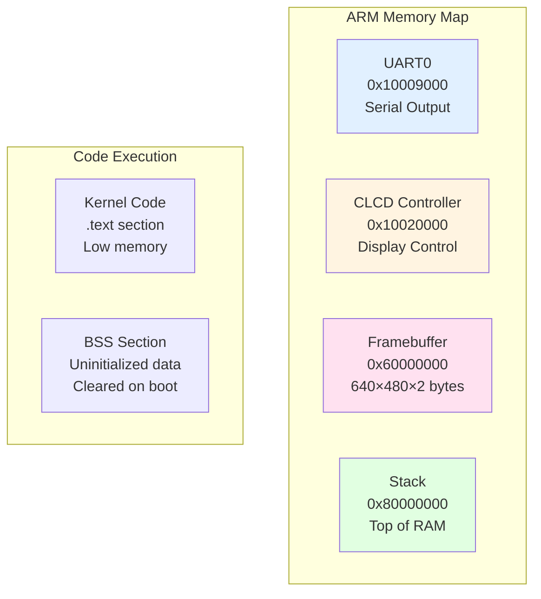
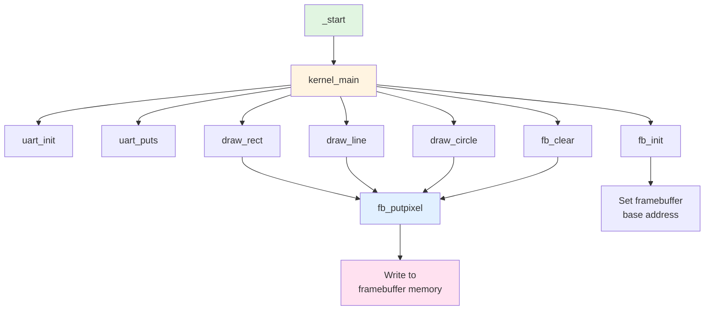

# Embedded Graphics Code Flow

## Kernel Execution Flow

```mermaid
flowchart TD
    Start([QEMU Boot]) --> BootCode[Boot: start.S]
    BootCode --> SetupStack[Setup Stack: SP = 0x80000000]
    SetupStack --> ClearBSS[Clear BSS Section]
    ClearBSS --> CallMain[Call kernel_main]
    
    CallMain --> UARTInit[Initialize UART<br/>UART0 @ 0x10009000]
    UARTInit --> PrintKernel[Print: 'Kernel started']
    
    PrintKernel --> FBInit[fb_init<br/>640x480 @ 16bpp<br/>Base: 0x60000000]
    FBInit --> SetFBPtr[Set framebuffer pointer<br/>Initialize width/height/pitch]
    
    SetFBPtr --> PrintFB[Print: 'Framebuffer initialized']
    PrintFB --> FBClear[fb_clear<br/>Color: 0x0020 dark gray]
    FBClear --> ClearLoop[Loop: Write color to all pixels<br/>Total: 640 × 480 pixels]
    ClearLoop --> PrintClear[Print: 'Screen cleared']
    
    PrintClear --> DrawRect[draw_rect<br/>50, 50, 150x100<br/>Color: 0xF800 red]
    DrawRect --> RectLoop[Loop: Draw rectangle edges<br/>Top, bottom, left, right]
    RectLoop --> DrawLine[draw_line<br/>50,50 to 200,150<br/>Color: 0x07E0 green]
    DrawLine --> LineBresenham[Bresenham line algorithm<br/>Calculate dx, dy, error]
    LineBresenham --> LineLoop[Loop: Draw pixels along line]
    LineLoop --> DrawCircle[draw_circle<br/>Center: 320,240 Radius: 60<br/>Color: 0x001F blue]
    DrawCircle --> CircleAlgo[Circle drawing algorithm<br/>8-point symmetry]
    CircleAlgo --> CircleLoop[Loop: Draw circle pixels]
    
    CircleLoop --> PrintDone[Print: 'Graphics drawn']
    PrintDone --> InfiniteLoop[Infinite Loop: while 1]
    
    style Start fill:#e1f5e1
    style BootCode fill:#fff4e1
    style FBInit fill:#e1f0ff
    style DrawRect fill:#ffe1f0
    style DrawLine fill:#e1ffe1
    style DrawCircle fill:#f0e1ff
    style InfiniteLoop fill:#ffe1e1
```

## Graphics Drawing Operations Detail

```mermaid
flowchart LR
    subgraph "Drawing Functions"
        DrawFunc[draw_rect/draw_line/draw_circle]
    end
    
    subgraph "Framebuffer Operations"
        PutPixel[fb_putpixel]
        BoundsCheck{Bounds Check<br/>x, y valid?}
        CalcOffset[Calculate offset<br/>y * width + x]
        WritePixel[Write pixel to<br/>framebuffer memory<br/>@ 0x60000000]
    end
    
    DrawFunc --> PutPixel
    PutPixel --> BoundsCheck
    BoundsCheck -->|Valid| CalcOffset
    BoundsCheck -->|Invalid| Skip[Skip pixel]
    CalcOffset --> WritePixel
    
    style PutPixel fill:#e1f0ff
    style WritePixel fill:#ffe1f0
```

## Verification Script Flow

```mermaid
flowchart TD
    Start([verify-framebuffer.sh]) --> Cleanup[Remove old files<br/>framebuffer.raw<br/>screenshot.png]
    Cleanup --> StartQEMU[Start QEMU<br/>-M vexpress-a9<br/>-kernel kernel8.img<br/>-s -S GDB server<br/>-display none]
    StartQEMU --> Wait[Wait 2 seconds<br/>for initialization]
    Wait --> ConnectGDB[Connect GDB<br/>target remote :1234]
    ConnectGDB --> DumpMemory[Dump framebuffer memory<br/>0x4C000000 to 0x4C096000<br/>640×480×2 bytes]
    DumpMemory --> SaveRaw[Save to framebuffer.raw]
    SaveRaw --> CheckDump{Dump<br/>successful?}
    CheckDump -->|Yes| ConvertPNG[Convert to PNG<br/>python3 utils/screenshot.py]
    CheckDump -->|No| ErrorDump[Error: GDB failed]
    ConvertPNG --> CheckPNG{PNG<br/>created?}
    CheckPNG -->|Yes| OpenImage[Open screenshot.png]
    CheckPNG -->|No| ErrorPNG[Error: PIL/Pillow<br/>not installed]
    OpenImage --> StopQEMU[Kill QEMU process]
    ErrorDump --> StopQEMU
    ErrorPNG --> StopQEMU
    StopQEMU --> End([End])
    
    style Start fill:#e1f5e1
    style StartQEMU fill:#fff4e1
    style DumpMemory fill:#e1f0ff
    style ConvertPNG fill:#ffe1f0
    style OpenImage fill:#e1ffe1
    style End fill:#ffe1e1
```

## Memory Layout

```mermaid
flowchart TD
    subgraph "ARM Memory Map"
        UART[UART0<br/>0x10009000<br/>Serial Output]
        CLCD[CLCD Controller<br/>0x10020000<br/>Display Control]
        VRAM[Framebuffer<br/>0x60000000<br/>640×480×2 bytes]
        Stack[Stack<br/>0x80000000<br/>Top of RAM]
    end
    
    subgraph "Code Execution"
        Code[Kernel Code<br/>.text section<br/>Low memory]
        BSS[BSS Section<br/>Uninitialized data<br/>Cleared on boot]
    end
    
    style UART fill:#e1f0ff
    style CLCD fill:#fff4e1
    style VRAM fill:#ffe1f0
    style Stack fill:#e1ffe1
```

## Function Call Hierarchy

```mermaid
graph TD
    _start --> kernel_main
    kernel_main --> uart_init
    kernel_main --> uart_puts
    kernel_main --> fb_init
    kernel_main --> fb_clear
    kernel_main --> draw_rect
    kernel_main --> draw_line
    kernel_main --> draw_circle
    
    draw_rect --> fb_putpixel
    draw_line --> fb_putpixel
    draw_circle --> fb_putpixel
    
    fb_init --> SetMemory[Set framebuffer<br/>base address]
    fb_clear --> fb_putpixel
    fb_putpixel --> MemoryWrite[Write to<br/>framebuffer memory]
    
    style _start fill:#e1f5e1
    style kernel_main fill:#fff4e1
    style fb_putpixel fill:#e1f0ff
    style MemoryWrite fill:#ffe1f0
```

